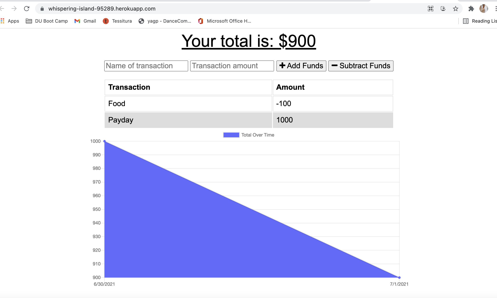
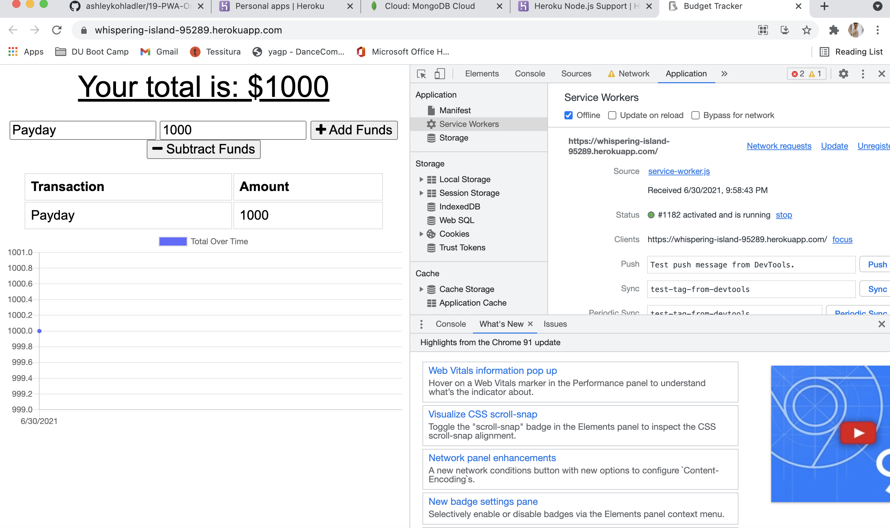

# 19-PWA-Online-Offline-Budget-Tracker

# Table of Contents

1. [Description](#Description)
2. [Features](#Features)
3. [Installation](#installation)
3. [License](#License)
4. [Contributing](#Contributing)
5. [Questions](#Questions)
6. [Screenshot](#screenshot)

# Description 

My task was to add functionality to our existing Budget Tracker application to allow for offline access and functionality.

The user will be able to add expenses and deposits to their budget with or without a connection. When entering transactions offline, they should populate the total when brought back online.

Offline Functionality:

Enter deposits offline

Enter expenses offline

When brought back online:

Offline entries should be added to tracker.

# Features
- NodeJS
- MongoDB
- Nosql
- Webpack
- Service-worker

# License

## This application is covered by the MIT license. 

# Contributing
Contributions are excepted. Fill free to fork. 

# Questions
## GitHub User name 
ashleykohladler

### Link to GitHub:
https://github.com/ashleykohladler/19-PWA-Online-Offline-Budget-Tracker

### Link to Heroku:
https://whispering-island-95289.herokuapp.com/

### Email address 
ashleykohladler@gmail.com

### Screenshot

 
 